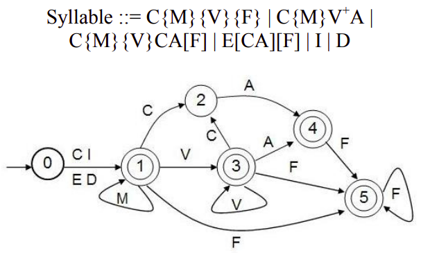

## Regular Expressions, Text Normalization, Edit Distance

#### Syllable Segmentation

```text
ကျောင်းသား -----> ကျောင်း + သား 
အတွေးအခေါ် -----> အ + တွေး + အ + ခေါ်
တက္ကသိုလ် -----> တက် + က + သိုလ် 
ဂျော့ချ်ဘုရှ် ----> ဂျော့ချ် + ဘုရှ်  
မင်္ဂလာပါ ----> မင်် + ဂ + လာ + ပါ
```


- How to run
```{r, engine='bash', count_lines}
python ./sylbreak.py -i ../data/input.txt -o output.txt -s " "
```
#### Myanmar Text Preprocessing

```text
ကျွန်တော် ကျန်းမာတယ်၊ ဒါပေမဲ့ အလုပ်များတယ်။ -----> ကျန်းမာ + တယ် + အလုပ် + များ + တယ်
မြန်မာပြည်လူအခွင့်အရေးကိုလျစ်လျူမရှုဖို့တိုက်တွန်း -----> မြန်မာ + ပြည် + လူ + အခွင့် + အရေး + ကို + လျစ်လျူမရှု + ဖို့ + တိုက်တွန်း
```
- Cleaning the text - remove all punc including "။" and english words and numbers
- Remove stop words and
- Tokenize the text using pyidaungsu library 
```{r, engine='bash', count_lines}
pip install pyidaungsu
```
- How to run - use -s for seperating
```{r, engine='bash', count_lines}
python ./text-preprocessing.py -i ../data/input.txt -o output.txt -s "|"
```
#### Myanmar POS Tagging with Hidden Markov Models and variation on Viterbi Algorithm

```text
မင်္ဂလာ ပါ ။ -----> မင်္ဂလာ/n ပါ/part ။/punc
နေကောင်း လား ။ -----> နေကောင်း/v လား/part ။/punc
ကျန်းမာ တယ် ၊ ဒါပေမဲ့ အလုပ် များ တယ် ။ -----> ကျန်းမာ/adj တယ်/part ၊/punc ဒါပေမဲ့/conj အလုပ်/n များ/adj တယ်/part ။/punc
မြန်မာ ပြည် လူ အခွင့် အရေး ကို လျစ်လျူမရှုဖို့ တိုက်တွန်း ။ -----> မြန်မာ/n ပြည်/n လူ/n အခွင့်/adj အရေး/n ကို/part လျစ်လျူမရှုဖို့/adj တိုက်တွန်း/adj ။/punc
```
- Extracted 550 sentences from train portion and concatenate with the whole test portion of [myPos-v3.0](https://github.com/ye-kyaw-thu/myPOS/tree/master/corpus-ver-3.0) corpus without pipes "|" for training the HMM
- How to train - input is training tagged corpus and output is model file including tagged word with probabilities
```{r, engine='bash', count_lines}
python ./pos-tag-hmm-train.py -i ../data/pos-tagging-train.txt -o hmmmodel.txt
```
- How to run - input are test data for -i model file for -m and output is the tagged result
```{r, engine='bash', count_lines}
python ./pos-tag.py -i ../data/pos-input.txt -m ./hmmmodel.txt -o output.txt
```

References : 
<br>
[1] Maung, Zin Maung, and Yoshiki Mikami. "A rule-based syllable segmentation of Myanmar text." Proceedings of the IJCNLP-08 Workshop on NLP for Less Privileged Languages. 2008.
<br>
[2] Khin War War Htike, Ye Kyaw Thu, Zuping Zhang, Win Pa Pa, Yoshinori Sagisaka and Naoto Iwahashi, "Comparison of Six POS Tagging Methods on 10K Sentences Myanmar Language (Burmese) POS Tagged Corpus", at 18th International Conference on Computational Linguistics and Intelligent Text Processing (CICLing 2017), April 17~23, 2017, Budapest, Hungary.
<br>
[3] Zar Zar Hlaing, Ye Kyaw Thu, Myat Myo Nwe Wai, Thepchai Supnithi, Ponrudee Netisopakul, "Myanmar POS resource extension effects on automatic tagging methods", In Proceedings of the 15th International Joint Symposium on Artificial Intelligence and Natural Language Processing (iSAI-NLP 2020), Nov 18 to Nov 20, 2020, Bangkok, Thailand, pp. 189-194. 

